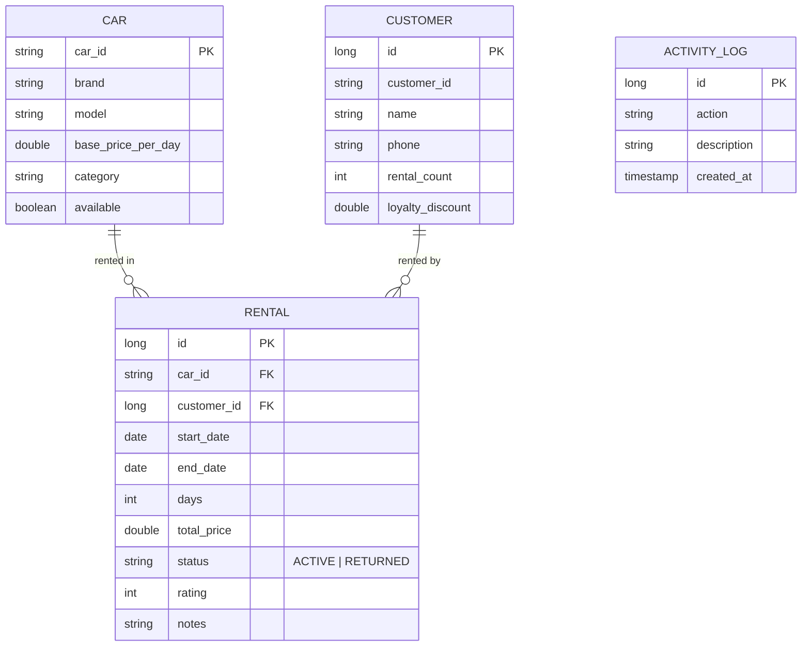
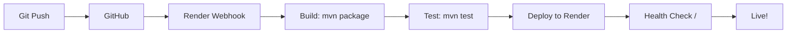

# Rentify — Car Rental Management System

A full-stack Car Rental Management System built with **Java 17** and **Spring Boot 3.2.5**. Evolved from a console application into a production-ready web platform featuring a 3-layer architecture, H2 database persistence, PDF receipt generation, Chart.js analytics, loyalty discounts, and an AI assistant powered by OpenRouter.


---

## Architecture & System Design

```
┌─────────────────────────────────────────────────────────────┐
│                    PRESENTATION LAYER                        │
│  ┌──────────┐  ┌──────────┐  ┌──────────┐  ┌─────────────┐ │
│  │Thymeleaf │  │ HTML/CSS │  │Chart.js  │  │  AI Chatbot │ │
│  │Templates │  │  (RWD)   │  │(Analytics)│  │ (Markdown)  │ │
│  └────┬─────┘  └────┬─────┘  └────┬─────┘  └──────┬──────┘ │
│       │              │              │                │       │
├───────┴──────────────┴──────────────┴────────────────┴───────┤
│                    CONTROLLER LAYER                            │
│  ┌─────────────────────────────────────────────────────────┐  │
│  │           RentalController (HTTP Routes)                 │  │
│  │  /  /rent  /return  /history  /charts  /cars  /customer │  │
│  │  /about  /agreement/{id}  /activity  /export/csv        │  │
│  └──────────────────────┬──────────────────────────────────┘  │
│  ┌──────────────────────┴──────────────────────────────────┐  │
│  │              ChatController (AI - REST API)              │  │
│  │  POST /api/chat  →  OpenRouter (Free LLM Models)        │  │
│  │  Injects live DB context → Intelligent responses        │  │
│  └──────────────────────┬──────────────────────────────────┘  │
├─────────────────────────┴────────────────────────────────────┤
│                    SERVICE LAYER                               │
│  ┌─────────────────────────────────────────────────────────┐  │
│  │              CarRentalSystem (Business Logic)             │  │
│  │  ┌───────────┐ ┌──────────┐ ┌─────────┐ ┌───────────┐  │  │
│  │  │ Fleet Mgmt│ │Rental    │ │Customer │ │ Analytics  │  │  │
│  │  │ CRUD      │ │Booking   │ │Loyalty  │ │ Insights   │  │  │
│  │  └───────────┘ └──────────┘ └─────────┘ └───────────┘  │  │
│  │  ┌───────────┐ ┌──────────┐ ┌───────────────────────┐  │  │
│  │  │ PDF Gen   │ │Activity  │ │ Rating & Review       │  │  │
│  │  │ (iText)   │ │ Logging  │ │ System                │  │  │
│  │  └───────────┘ └──────────┘ └───────────────────────┘  │  │
│  └──────────────────────┬──────────────────────────────────┘  │
├─────────────────────────┴────────────────────────────────────┤
│                    REPOSITORY LAYER (Spring Data JPA)           │
│  ┌──────────────┐  ┌──────────────┐  ┌──────────────────┐    │
│  │ CarRepository │  │ RentalRepo   │  │ CustomerRepo     │    │
│  │ (CRUD + Query)│  │ (Overlap +   │  │ (Phone Search)   │    │
│  └──────┬───────┘  │  Status)     │  └────────┬─────────┘    │
│         │          └──────┬───────┘           │               │
│         └─────────────────┴───────────────────┘               │
├────────────────────────────┴──────────────────────────────────┤
│                    DATABASE LAYER                               │
│  ┌─────────────────────────────────────────────────────────┐  │
│  │              H2 Database (Embedded SQL)                   │  │
│  │  ┌───────────┐  ┌───────────┐  ┌─────────────────────┐  │  │
│  │  │   cars    │  │ customers │  │      rentals        │  │  │
│  │  │ ────PK   │  │ ────PK   │  │ ────PK               │  │  │
│  │  │ car_id    │  │ id        │  │ car_id (FK → cars)  │  │  │
│  │  │ brand     │  │ name      │  │ customer_id (FK→cus)│  │  │
│  │  │ model     │  │ phone     │  │ start_date          │  │  │
│  │  │ price     │  │ rental_cnt│  │ end_date            │  │  │
│  │  │ category  │  │ discount  │  │ total_price         │  │  │
│  │  └───────────┘  └───────────┘  │ status (ACTIVE/    │  │  │
│  │  ┌───────────┐                 │ RETURNED)           │  │  │
│  │  │ activity  │                 │ rating, notes       │  │  │
│  │  │ _log      │                 └─────────────────────┘  │  │
│  │  └───────────┘                                          │  │
│  └─────────────────────────────────────────────────────────┘  │
└───────────────────────────────────────────────────────────────┘
```

### Design Patterns

| Pattern | Usage |
|---------|-------|
| **3-Layer Architecture** | Controller → Service → Repository — clean separation of concerns |
| **Dependency Injection** | Spring Boot DI for all services and repositories |
| **Repository Pattern** | Spring Data JPA for database abstraction |
| **DTO Pattern** | Model entities used across layers |
| **Template Method** | Thymeleaf layouts for consistent UI |
| **Strategy Pattern** | Fallback model strategy for AI chatbot |

---

## Features

### Core Features
| Feature | Description |
|---------|-------------|
| **Fleet Management** | Add, delete, and view cars with categories and pricing |
| **Date-Based Booking** | Rent cars with date picker, live price preview, and double-booking prevention |
| **One-Click Return** | Return any active rental instantly |
| **Rental History** | Complete record of active and completed rentals |
| **PDF Receipts** | Professional PDF receipt for every booking via iText |
| **Revenue Charts** | Monthly revenue bar chart + category doughnut chart via Chart.js |
| **CSV Export** | Download complete rental history as CSV |

### Advanced Features
| Feature | Description |
|---------|-------------|
| **Customer Profiles** | Search customers by phone, view full rental history with stats |
| **Customer Ratings** | Rate returned rentals (1-5 stars), average rating per car |
| **Loyalty Discounts** | 3 rentals → 5% off, 5 rentals → 10% off, 10+ rentals → 15% off |
| **Activity Log** | Track all actions — add/delete/rent/return with timestamps |
| **Booking Notes** | Add special requests when renting (baby seat, preferred color, etc.) |
| **Dashboard Insights** | Most rented car, top customer, busiest month, avg rental duration |
| **Print Agreement** | Print-friendly rental agreement with full terms and conditions |
| **AI Assistant** | Intelligent chatbot that knows everything about the fleet and system |
| **Dark/Light Theme** | Toggle between dark and light mode with persistence |

---

## Tech Stack

### Backend
| Technology | Purpose |
|------------|---------|
| Java 17 | Core programming language |
| Spring Boot 3.2.5 | Web framework + dependency injection |
| Spring Data JPA | Database ORM layer |
| H2 Database | Embedded persistent SQL database |
| iText PDF 5 | PDF receipt generation |
| Maven | Build and dependency management |

### Frontend
| Technology | Purpose |
|------------|---------|
| Thymeleaf | Server-side HTML templating |
| HTML5 + CSS3 | Mobile-first responsive design |
| Vanilla JavaScript | Dynamic interactions, price preview |
| Chart.js | Interactive revenue and category charts |
| Marked.js | Markdown rendering in AI chatbot |
| KaTeX | LaTeX math rendering in AI chatbot |

### Deployment
| Platform | Method |
|----------|--------|
| Render | Auto-deploy from GitHub (via `render.yaml`) |
| Railway | Alternative deployment option |

---

## Data Model



---

## Quick Start

### Prerequisites
- **Java 17+** ([Download](https://adoptium.net))
- **Maven 3.8+** ([Download](https://maven.apache.org))

### Run Locally
```bash
# Clone the repository
git clone https://github.com/bikash-20/2nd-year-java-project.git
cd 2nd-year-java-project

# Run the application
mvn spring-boot:run

# Open in browser
open http://localhost:8081
```

### Build & Run JAR
```bash
mvn clean package
java -jar target/AutoRentWeb-1.0.jar
```

### Environment Variables
| Variable | Default | Description |
|----------|---------|-------------|
| `PORT` | `8081` | Server port |
| `OPENROUTER_API_KEY` | — | API key for AI chatbot (optional, free models used otherwise) |

---

## API Endpoints

### Pages
| Method | Path | Description |
|--------|------|-------------|
| GET | `/` | Dashboard with fleet overview and insights |
| GET | `/rent` | Car rental form with date picker |
| POST | `/rent` | Submit rental booking |
| GET | `/return` | Car return page |
| POST | `/return` | Submit car return |
| GET | `/history` | Rental history |
| GET | `/charts` | Revenue and category analytics |
| GET | `/cars` | Fleet management |
| POST | `/cars/add` | Add new car |
| POST | `/cars/delete` | Remove car from fleet |
| GET | `/customer` | Customer search |
| GET | `/customer/profile?id=X` | Customer profile |
| GET | `/activity` | System activity log |
| GET | `/about` | Developer information |
| GET | `/agreement/{id}` | Print-friendly rental agreement |

### Data Endpoints
| Method | Path | Description |
|--------|------|-------------|
| GET | `/receipt/{id}` | Download PDF receipt |
| GET | `/export/csv` | Download rental history as CSV |
| POST | `/api/chat` | AI chatbot API |

---

## Deployment to Render

### Automatic (via render.yaml)
1. Push your code to GitHub
2. In Render Dashboard → New → Blueprint
3. Connect your GitHub repository
4. Render auto-detects `render.yaml` and deploys

### Manual Setup
1. Create a **Web Service** on Render
2. Connect your GitHub repo
3. Set:
   - **Build Command:** `mvn clean package -DskipTests`
   - **Start Command:** `java -jar target/AutoRentWeb-1.0.jar`
   - **Auto-Deploy:** Yes
4. Add Environment Variable: `PORT = 8080`

## CI/CD Pipeline



Every push to the `main` branch triggers automatic build, test, and deployment.

---

## AI Assistant

The built-in AI chatbot uses OpenRouter's free LLM models with automatic fallback:
1. **Meta Llama 3.3 70B** (primary)
2. **OpenRouter Free** (fallback)
3. **Google Gemma 2 9B** (secondary fallback)
4. **Meta Llama 3.2 3B** (last resort)

The AI has **live access** to the entire database — fleet, pricing, rentals, revenue, customer ratings, and loyalty tiers. It can answer questions about:
- Available cars and pricing
- Revenue and business insights
- Customer rental history
- Loyalty discounts
- Feature guidance and troubleshooting

---

## Project Structure

```
Rentify/
├── render.yaml                    # Render deployment config
├── Procfile                        # Process definition
├── pom.xml                         # Maven build
├── README.md                       # This file
├── src/
│   ├── main/
│   │   ├── java/carrental/
│   │   │   ├── App.java            # Entry point
│   │   │   ├── model/              # JPA entities
│   │   │   ├── repository/         # Data access layer
│   │   │   ├── service/            # Business logic
│   │   │   └── controller/         # HTTP routes
│   │   └── resources/
│   │       ├── templates/          # Thymeleaf pages
│   │       ├── static/             # CSS, JS, images
│   │       └── application.properties
│   └── test/
└── target/                         # Build output
```

---

## Author

**Bikash Talukder**
Second Year Computer Science & Engineering Student

- [LinkedIn](https://www.linkedin.com/in/bikash-talukder-6497633b8/)
- [GitHub](https://github.com/bikash-20)

Built with Java + Spring Boot

---

## License

This project is licensed under the MIT License — see the LICENSE file for details.

---

*If you found this project useful, please give it a star on GitHub!*
