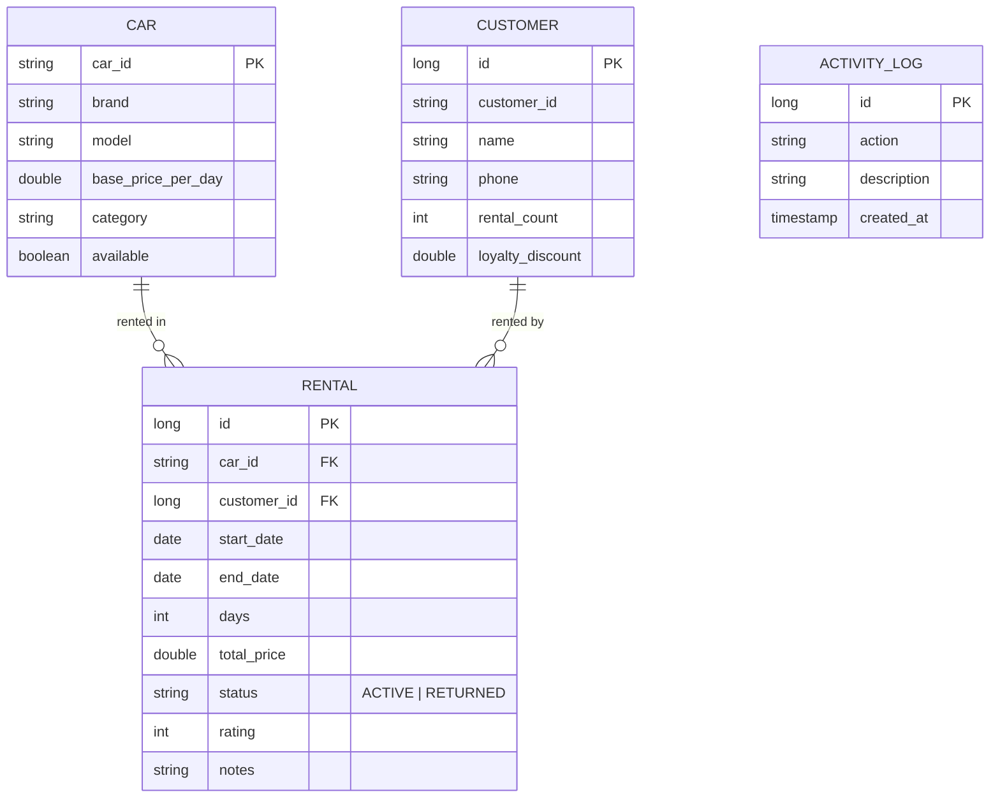
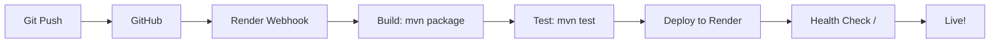

# Rentify — Car Rental Management System

A full-stack Car Rental Management System built with **Java 17** and **Spring Boot 3.2.5**. Evolved from a console application into a production-ready web platform featuring a 3-layer architecture, H2 database persistence, PDF receipt generation, Chart.js analytics, loyalty discounts, and an AI assistant powered by OpenRouter.


---

## Architecture & System Design

```
┌─────────────────────────────────────────────────────────────┐
│                    PRESENTATION LAYER                        │
│  ┌──────────┐  ┌──────────┐  ┌──────────┐  ┌─────────────┐ │
│  │Thymeleaf │  │ HTML/CSS │  │Chart.js  │  │  AI Chatbot │ │
│  │Templates │  │  (RWD)   │  │(Analytics)│  │ (Markdown)  │ │
│  └────┬─────┘  └────┬─────┘  └────┬─────┘  └──────┬──────┘ │
│       │              │              │                │       │
├───────┴──────────────┴──────────────┴────────────────┴───────┤
│                    CONTROLLER LAYER                            │
│  ┌─────────────────────────────────────────────────────────┐  │
│  │           RentalController (HTTP Routes)                 │  │
│  │  /  /rent  /return  /history  /charts  /cars  /customer │  │
│  │  /about  /agreement/{id}  /activity  /export/csv        │  │
│  └──────────────────────┬──────────────────────────────────┘  │
│  ┌──────────────────────┴──────────────────────────────────┐  │
│  │              ChatController (AI - REST API)              │  │
│  │  POST /api/chat  →  OpenRouter (Free LLM Models)        │  │
│  │  Injects live DB context → Intelligent responses        │  │
│  └──────────────────────┬──────────────────────────────────┘  │
├─────────────────────────┴────────────────────────────────────┤
│                    SERVICE LAYER                               │
│  ┌─────────────────────────────────────────────────────────┐  │
│  │              CarRentalSystem (Business Logic)             │  │
│  │  ┌───────────┐ ┌──────────┐ ┌─────────┐ ┌───────────┐  │  │
│  │  │ Fleet Mgmt│ │Rental    │ │Customer │ │ Analytics  │  │  │
│  │  │ CRUD      │ │Booking   │ │Loyalty  │ │ Insights   │  │  │
│  │  └───────────┘ └──────────┘ └─────────┘ └───────────┘  │  │
│  │  ┌───────────┐ ┌──────────┐ ┌───────────────────────┐  │  │
│  │  │ PDF Gen   │ │Activity  │ │ Rating & Review       │  │  │
│  │  │ (iText)   │ │ Logging  │ │ System                │  │  │
│  │  └───────────┘ └──────────┘ └───────────────────────┘  │  │
│  └──────────────────────┬──────────────────────────────────┘  │
├─────────────────────────┴────────────────────────────────────┤
│                    REPOSITORY LAYER (Spring Data JPA)           │
│  ┌──────────────┐  ┌──────────────┐  ┌──────────────────┐    │
│  │ CarRepository │  │ RentalRepo   │  │ CustomerRepo     │    │
│  │ (CRUD + Query)│  │ (Overlap +   │  │ (Phone Search)   │    │
│  └──────┬───────┘  │  Status)     │  └────────┬─────────┘    │
│         │          └──────┬───────┘           │               │
│         └─────────────────┴───────────────────┘               │
├────────────────────────────┴──────────────────────────────────┤
│                    DATABASE LAYER                               │
│  ┌─────────────────────────────────────────────────────────┐  │
│  │              H2 Database (Embedded SQL)                   │  │
│  │  ┌───────────┐  ┌───────────┐  ┌─────────────────────┐  │  │
│  │  │   cars    │  │ customers │  │      rentals        │  │  │
│  │  │ ────PK   │  │ ────PK   │  │ ────PK               │  │  │
│  │  │ car_id    │  │ id        │  │ car_id (FK → cars)  │  │  │
│  │  │ brand     │  │ name      │  │ customer_id (FK→cus)│  │  │
│  │  │ model     │  │ phone     │  │ start_date          │  │  │
│  │  │ price     │  │ rental_cnt│  │ end_date            │  │  │
│  │  │ category  │  │ discount  │  │ total_price         │  │  │
│  │  └───────────┘  └───────────┘  │ status (ACTIVE/    │  │  │
│  │  ┌───────────┐                 │ RETURNED)           │  │  │
│  │  │ activity  │                 │ rating, notes       │  │  │
│  │  │ _log      │                 └─────────────────────┘  │  │
│  │  └───────────┘                                          │  │
│  └─────────────────────────────────────────────────────────┘  │
└───────────────────────────────────────────────────────────────┘
```

### Design Patterns

| Pattern | Usage |
|---------|-------|
| **3-Layer Architecture** | Controller → Service → Repository — clean separation of concerns |
| **Dependency Injection** | Spring Boot DI for all services and repositories |
| **Repository Pattern** | Spring Data JPA for database abstraction |
| **DTO Pattern** | Model entities used across layers |
| **Template Method** | Thymeleaf layouts for consistent UI |
| **Strategy Pattern** | Fallback model strategy for AI chatbot |

---

## Features

### Core Features
| Feature | Description |
|---------|-------------|
| **Fleet Management** | Add, delete, and view cars with categories and pricing |
| **Date-Based Booking** | Rent cars with date picker, live price preview, and double-booking prevention |
| **One-Click Return** | Return any active rental instantly |
| **Rental History** | Complete record of active and completed rentals |
| **PDF Receipts** | Professional PDF receipt for every booking via iText |
| **Revenue Charts** | Monthly revenue bar chart + category doughnut chart via Chart.js |
| **CSV Export** | Download complete rental history as CSV |

### Advanced Features
| Feature | Description |
|---------|-------------|
| **Customer Profiles** | Search customers by phone, view full rental history with stats |
| **Customer Ratings** | Rate returned rentals (1-5 stars), average rating per car |
| **Loyalty Discounts** | 3 rentals → 5% off, 5 rentals → 10% off, 10+ rentals → 15% off |
| **Activity Log** | Track all actions — add/delete/rent/return with timestamps |
| **Booking Notes** | Add special requests when renting (baby seat, preferred color, etc.) |
| **Dashboard Insights** | Most rented car, top customer, busiest month, avg rental duration |
| **Print Agreement** | Print-friendly rental agreement with full terms and conditions |
| **AI Assistant** | Intelligent chatbot that knows everything about the fleet and system |
| **Dark/Light Theme** | Toggle between dark and light mode with persistence |

---

## Tech Stack

### Backend
| Technology | Purpose |
|------------|---------|
| Java 17 | Core programming language |
| Spring Boot 3.2.5 | Web framework + dependency injection |
| Spring Data JPA | Database ORM layer |
| H2 Database | Embedded persistent SQL database |
| iText PDF 5 | PDF receipt generation |
| Maven | Build and dependency management |

### Frontend
| Technology | Purpose |
|------------|---------|
| Thymeleaf | Server-side HTML templating |
| HTML5 + CSS3 | Mobile-first responsive design |
| Vanilla JavaScript | Dynamic interactions, price preview |
| Chart.js | Interactive revenue and category charts |
| Marked.js | Markdown rendering in AI chatbot |
| KaTeX | LaTeX math rendering in AI chatbot |

### Deployment
| Platform | Method |
|----------|--------|
| Render | Auto-deploy from GitHub (via `render.yaml`) |
| Railway | Alternative deployment option |

---

## Data Model


```mermaid
erDiagram
    CAR {
        string car_id PK
        string brand
        string model
        double base_price_per_day
        string category
        boolean available
    }
    
    CUSTOMER {
        long id PK
        string customer_id
        string name
        string phone
        int rental_count
        double loyalty_discount
    }
    
    RENTAL {
        long id PK
        string car_id FK
        long customer_id FK
        date start_date
        date end_date
        int days
        double total_price
        string status "ACTIVE | RETURNED"
        int rating
        string notes
    }
    
    ACTIVITY_LOG {
        long id PK
        string action
        string description
        timestamp created_at
    }
    
    CAR ||--o{ RENTAL : "rented in"
    CUSTOMER ||--o{ RENTAL : "rented by"
```

---

## Quick Start

### Prerequisites
- **Java 17+** ([Download](https://adoptium.net))
- **Maven 3.8+** ([Download](https://maven.apache.org))

### Live Demo
The app is live at: **https://rentify-ifs4.onrender.com**

### Run Locally
```bash
# Clone the repository
git clone https://github.com/bikashpubg678-maker/Rentify-java-project.git
cd Rentify-java-project

# Run the application
mvn spring-boot:run

# Open in browser
open http://localhost:8081
```

### Build & Run JAR
```bash
mvn clean package
java -jar target/AutoRentWeb-1.0.jar
```

### Environment Variables
| Variable | Default | Description |
|----------|---------|-------------|
| `PORT` | `8081` | Server port |
| `OPENROUTER_API_KEY` | — | API key for AI chatbot (optional, free models used otherwise) |

---

## API Endpoints

### Pages
| Method | Path | Description |
|--------|------|-------------|
| GET | `/` | Dashboard with fleet overview and insights |
| GET | `/rent` | Car rental form with date picker |
| POST | `/rent` | Submit rental booking |
| GET | `/return` | Car return page |
| POST | `/return` | Submit car return |
| GET | `/history` | Rental history |
| GET | `/charts` | Revenue and category analytics |
| GET | `/cars` | Fleet management |
| POST | `/cars/add` | Add new car |
| POST | `/cars/delete` | Remove car from fleet |
| GET | `/customer` | Customer search |
| GET | `/customer/profile?id=X` | Customer profile |
| GET | `/activity` | System activity log |
| GET | `/about` | Developer information |
| GET | `/agreement/{id}` | Print-friendly rental agreement |

### Data Endpoints
| Method | Path | Description |
|--------|------|-------------|
| GET | `/receipt/{id}` | Download PDF receipt |
| GET | `/export/csv` | Download rental history as CSV |
| POST | `/api/chat` | AI chatbot API |

---

## Deployment to Render

### Automatic (via render.yaml)
1. Push your code to GitHub
2. In Render Dashboard → New → Blueprint
3. Connect your GitHub repository
4. Render auto-detects `render.yaml` and deploys

### Manual Setup
1. Create a **Web Service** on Render
2. Connect your GitHub repo
3. Set:
   - **Build Command:** `mvn clean package -DskipTests`
   - **Start Command:** `java -jar target/AutoRentWeb-1.0.jar`
   - **Auto-Deploy:** Yes
4. Add Environment Variable: `PORT = 8080`

## CI/CD Pipeline


```mermaid
graph LR
    A[Git Push] --> B[GitHub]
    B --> C[Render Webhook]
    C --> D[Build: mvn package]
    D --> E[Test: mvn test]
    E --> F[Deploy to Render]
    F --> G[Health Check /]
    G --> H[Live!]
```

Every push to the `main` branch triggers automatic build, test, and deployment.

---

## AI Assistant

The built-in AI chatbot uses OpenRouter's free LLM models with automatic fallback:
1. **Meta Llama 3.3 70B** (primary)
2. **OpenRouter Free** (fallback)
3. **Google Gemma 2 9B** (secondary fallback)
4. **Meta Llama 3.2 3B** (last resort)

The AI has **live access** to the entire database — fleet, pricing, rentals, revenue, customer ratings, and loyalty tiers. It can answer questions about:
- Available cars and pricing
- Revenue and business insights
- Customer rental history
- Loyalty discounts
- Feature guidance and troubleshooting

---

## Project Structure

```
Rentify/
├── render.yaml                    # Render deployment config
├── Procfile                        # Process definition
├── pom.xml                         # Maven build
├── README.md                       # This file
├── src/
│   ├── main/
│   │   ├── java/carrental/
│   │   │   ├── App.java            # Entry point
│   │   │   ├── model/              # JPA entities
│   │   │   ├── repository/         # Data access layer
│   │   │   ├── service/            # Business logic
│   │   │   └── controller/         # HTTP routes
│   │   └── resources/
│   │       ├── templates/          # Thymeleaf pages
│   │       ├── static/             # CSS, JS, images
│   │       └── application.properties
│   └── test/
└── target/                         # Build output
```

---

## Author

**Bikash Talukder**
Second Year Computer Science & Engineering Student

- [LinkedIn](https://www.linkedin.com/in/bikash-talukder-6497633b8/)
- [GitHub](https://github.com/bikash-20)

Built with Java + Spring Boot

---

## License

This project is licensed under the MIT License — see the LICENSE file for details.

---

*If you found this project useful, please give it a star on GitHub!*
---

## Authentication Architecture

Rentify runs two independent authentication systems side-by-side: the Thymeleaf web UI uses Google OAuth2, and the mobile REST API uses JWT. A single SecurityConfig routes each request to the right chain based on URL pattern.

### Two systems, one app

```
+--------------------------------------------------------------------+
|                            CLIENT                                  |
|                                                                    |
|   Web Browser                              Mobile / JS App         |
|   (Thymeleaf pages)                        (REST API caller)       |
+----------+----------------------------------------+---------------+
           | Cookie-based session                   | Bearer token
           | (JSESSIONID)                           | (Auth header)
           v                                        v
+------------------------------+    +---------------------------------+
| /login, /oauth2/**, /        |    | /api/v1/**, /api/chat           |
| /logout/**, /error, /, /...  |    |                                 |
|         |                    |    |                                 |
|         v                    |    |                                 |
|   Spring Security            |    |   Spring Security               |
|   oauth2Login()              |    |   http.addFilterBefore(         |
|        |                     |    |     JwtAuthFilter,              |
|        v                     |    |     AuthFilter.class)           |
|  GoogleOAuth2UserService     |    |        |                        |
|  (upserts User row)          |    |        v                        |
|        |                     |    |   JwtService.verify()          |
|        v                     |    |   (HS256, jjwt 0.12.6)         |
|   AppOidcUser -> SecurityCtx |    |        |                        |
|   (ROLE_<user.role>)         |    |        v                        |
|                              |    |   Authentication stored in      |
+----------+-------------------+    |   SecurityContext              |
           |                        +------------+--------------------+
           |                                     |
           +-----------------+-------------------+
                             v
              +------------------------------+
              |  Controllers                  |
              |  (@PreAuthorize etc.)        |
              +-------------+----------------+
                            v
              +------------------------------+
              |  CarRentalSystem (service)   |
              +-------------+----------------+
                            v
              +------------------------------+
              |  JPA Repositories -> H2 DB   |
              +------------------------------+
```

### Three SecurityFilterChain beans (order matters)

SecurityConfig declares three chains. Spring Security picks the first whose securityMatcher matches the URL.

| # | Bean             | Matches                                  | Purpose                                                                                  |
|---|------------------|------------------------------------------|------------------------------------------------------------------------------------------|
| 1 | apiChain         | /api/v1/**, /api/chat                    | Stateless JWT verification, permitAll at the filter level. JwtAuthFilter decodes if present. |
| 2 | oauth2Chain      | /login, /oauth2/**, /logout/**, /error   | Hands off to Spring Security OAuth2 login. After Google callback, builds SecurityContext. |
| 3 | webChain         | /** (everything else)                    | Thymeleaf app. permitAll so anonymous browsing works; OAuth2 chain is the real auth gate. |

The oauth2Login() DSL wires three things:
- userInfoEndpoint(u -> u.oidcUserService(googleOAuth2UserService)) — custom service replaces Spring's default OidcUserService so we can upsert our own User entity.
- defaultSuccessUrl("/", true) — always redirect to / after success.
- failureUrl("/login?error") — back to login page with an error flag on failure.

### Google sign-in flow (end to end)

```
+--------+       +-----------+      +---------+      +-----------+
|  User  |       |  Rentify  |      | Google  |      |  H2 DB    |
| (brow) |       | (Spr Sec) |      | OAuth2  |      | User tbl  |
+----+---+       +-----+-----+      +----+----+      +-----+-----+
     | 1. GET /login   |                  |                 |
     |---------------->|                  |                 |
     | 2. login.html   |                  |                 |
     |<----------------|                  |                 |
     | 3. click "Sign in" -> /oauth2/authorization/google    |
     |---------------->|                  |                 |
     | 4. 302 to Google consent           |                 |
     |<----------------|                  |                 |
     | 5. user picks account + consents  |                 |
     |---------------------------------->|                 |
     | 6. 302 to /login/oauth2/code/google?code=...         |
     |<----------------------------------|                 |
     | 7. code + state                   |                 |
     |---------------->|                  |                 |
     | 8. POST to Google token endpoint  |                 |
     |---------------------------------->|                 |
     | 9. access_token + id_token (JWT)  |                 |
     |<----------------------------------|                 |
     | 10. Spring decodes id_token       |                 |
     |---------------->|                  |                 |
     | 11. GoogleOAuth2UserService.loadUser()              |
     |    (a) findByProviderAndProviderId("GOOGLE", sub)   |
     |--------------------------------------------------->|
     |    (b) if none, findByEmailIgnoreCase() -> link     |
     |--------------------------------------------------->|
     |    (c) if still none, User.fromGoogle(...) -> save  |
     |--------------------------------------------------->|
     | 12. AppOidcUser(OidcUser, User) wrapped as Authn    |
     | 13. SecurityContextHolder populated                 |
     | 14. 302 to /                                       |
     |<----------------|                                   |
     | 15. navbar shows "Sign out" (sec:authorize)         |
```

### The custom User entity (Google-aware)

```java
@Entity
@Table(name = "users", uniqueConstraints = {
    @UniqueConstraint(columnNames = {"provider", "providerId"})
})
public class User {
    @Id @GeneratedValue private Long id;
    private String displayName;
    private String email;

    // Google OAuth fields
    @Enumerated(EnumType.STRING) private Provider provider;   // LOCAL | GOOGLE
    private String providerId;                               // Google "sub"
    private String avatarUrl;                                // Google "picture"
    private String passwordHash;                             // nullable for Google users

    public static User fromGoogle(String email, String name, String sub, String picture) {
        User u = new User();
        u.provider = Provider.GOOGLE;
        u.providerId = sub;
        u.email = email;
        u.displayName = name;
        u.avatarUrl = picture;
        return u;
    }
}
```

Why nullable passwordHash? Local username/password users keep a BCrypt hash; Google users have null and can never log in via password — only via the OAuth chain.

### Why AppOidcUser wraps OidcUser

OidcUser carries Google's raw claims (sub, email, picture, etc.). Our controllers want our own User entity (so they can use email, displayName, role). AppOidcUser implements OidcUser and delegates every standard method, but exposes getAppUser() for use with @AuthenticationPrincipal in controllers or sec:authentication in Thymeleaf.

```java
public class AppOidcUser implements OidcUser {
    private final OidcUser delegate;   // Google's claims
    private final User appUser;        // Our DB row

    @Override public Collection<? extends GrantedAuthority> getAuthorities() {
        return List.of(new SimpleGrantedAuthority("ROLE_" + appUser.getRole()));
    }
    @Override public String getName() { return appUser.getDisplayName(); }
    // ...other OidcUser methods just delegate...
}
```

### How login.html and layout.html work together

templates/login.html is rendered by LoginController:

```java
@GetMapping("/login")
public String loginPage(@RequestParam(required=false) String error, Model model) {
    if (error != null) model.addAttribute("error", "Sign-in failed. Please try again.");
    return "login";
}
```

The page shows a centered card with a single "Continue with Google" button linking to /oauth2/authorization/google — that path is provided automatically by spring-boot-starter-oauth2-client.

In layout.html the html tag declares xmlns:sec pointing at the thymeleaf-extras-springsecurity6 namespace, and the navbar has:

```html
<li sec:authorize="isAnonymous()"><a href="/oauth2/authorization/google">Sign in</a></li>
<li sec:authorize="isAuthenticated()">
  <span sec:authentication="principal.attributes['name']">User</span>
  <form th:action="@{/logout}" method="post"><button>Sign out</button></form>
</li>
```

The Sign out form POSTs to /logout, which Spring Security's LogoutFilter handles (invalidates session, redirects to /login?logout).

### Render env vars you must set

| Key                  | Value                                       |
|----------------------|---------------------------------------------|
| GOOGLE_CLIENT_ID     | xxxxx.apps.googleusercontent.com            |
| GOOGLE_CLIENT_SECRET | GOCSPX-...                                  |

And in Google Cloud Console -> Credentials -> your OAuth client -> Authorized redirect URIs:

```
https://rentify-ifs4.onrender.com/login/oauth2/code/google
```

Without that exact URI Google returns redirect_uri_mismatch.

---

## Full Application Architecture

```
+------------------------------------------------------------------------+
|                       BROWSER  (any device)                            |
|                                                                        |
|   /  /rent  /return  /history  /charts  /cars  /customer  /activity   |
|   /about  /agreement/{id}  /export/csv  /login                        |
|                                                                        |
|   Floating AI Chatbot  (POST /api/chat)                                |
+----------------+-------------------------------------+-----------------+
                 | HTML / form POST                    | JSON / Bearer
                 |                                     |
        +--------v-----------+                +--------v----------+
        |    webChain        |                |     apiChain      |
        |  Spring Security   |                |  JwtAuthFilter -> |
        |  + oauth2Login()   |                |  SecurityContext  |
        +--------+-----------+                +---------+---------+
                 |                                      |
                 v                                      v
        +-------------------+                +-------------------+
        |  RentalController |                |  AuthController   |
        |  (Thymeleaf views)|                |  ChatController   |
        |  LoginController  |                |  ApiException...  |
        +---------+---------+                +---------+---------+
                  |                                    |
                  +-----------+------------+-----------+
                              v
                  +--------------------------+
                  |      CarRentalSystem     |
                  |  - Fleet / Cars / Rentals |
                  |  - Customers / Loyalty   |
                  |  - PDF Receipts          |
                  |  - Charts & Analytics    |
                  |  - Activity Log          |
                  |  - CSV Export            |
                  +-------------+------------+
                                v
                  +--------------------------+
                  |  JPA Repositories        |
                  |  CarRepository           |
                  |  RentalRepository        |
                  |  CustomerRepository      |
                  |  UserRepository (LOCAL+GOOGLE) |
                  +-------------+------------+
                                v
                  +--------------------------+
                  |   H2 In-Memory DB        |
                  |   jdbc:h2:mem:autorentdb |
                  +--------------------------+
                                |
                  +-------------v-------------+
                  |   External: OpenRouter     |
                  |   (LLM chat completions)   |
                  +---------------------------+
```

### Request lifecycle example — "Rent a car"

1. User fills /rent form -> POST to /rent.
2. webChain SecurityFilterChain passes it through (form endpoints are public for the demo).
3. RentalController.rentPage(...) parses form, calls CarRentalSystem.createRental(carId, customerId, days).
4. CarRentalSystem mutates in-memory state, adds to activity log, generates a receipt ID.
5. Controller returns "redirect:/agreement/{id}".
6. Browser follows redirect -> RentalController.agreementPage(...) renders Thymeleaf template with rental details.
7. User can then /return or /export/csv the rental.

### Why the JWT chain still exists alongside OAuth

The project doubles as a REST API for mobile clients (/api/v1/auth/login, /api/v1/cars, ...). Mobile clients cannot do Google web redirects cleanly, so they use username + password -> receive a JWT -> send it as Authorization header. The two chains never collide because:

- /api/** paths match apiChain first -> only JwtAuthFilter runs.
- Browser paths never hit /api/** -> only webChain + oauth2Chain run.
- Both chains end up writing to the same SecurityContextHolder, so any @PreAuthorize("hasRole('ADMIN')") check works regardless of how the user authenticated.